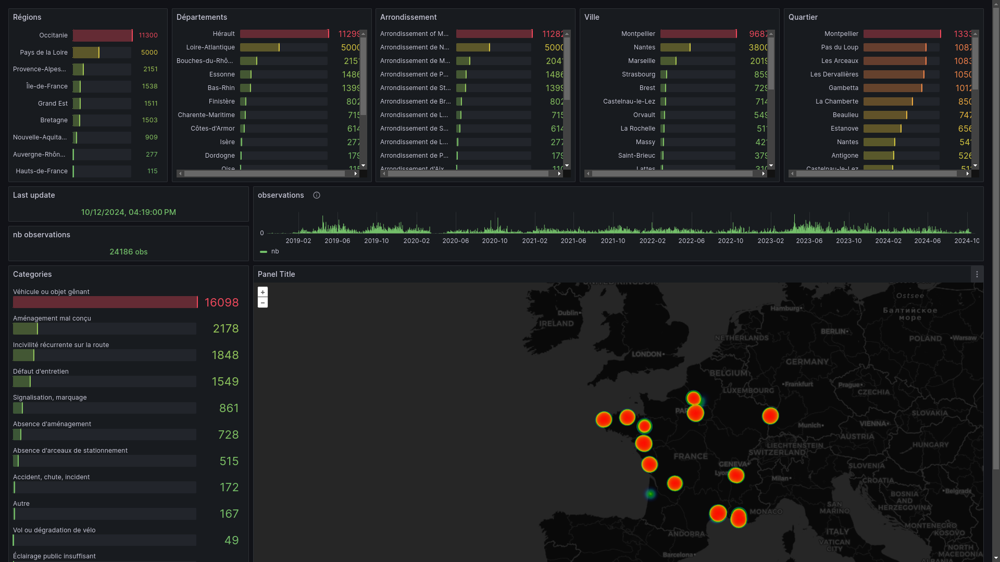

# world-datas-analysis

Miscellaneous worlds data and analysis



## Requirements

Installing prerequisites on various distributions

```bash
./install_requirements.sh
```

Works on :

- Alpine
- Archlinux
- Ubuntu

## Usage

```
just import     # Import data to PostgreSQL (used by grafana)
just chart      # open the grafana (admin/admin)
just stop       # stop the grafana server
```

**Note:** The grafana account is `admin/admin`

## Scopes reference

When you add new data to this project, you can sync with reference data by
scope.

For example, if you import a new dataset associated with cities, you can link
them with geonames city elements

<!-- BEGIN SCOPEREFERENCE -->

| provider | dataset                | wda_scope | source               | nb_variables | nb_entries |
| -------- | ---------------------- | --------- | -------------------- | -----------: | ---------: |
| geonames | wda_geonames_cities    | city      | https://geonames.org |           98 |     534217 |
| geonames | wda_geonames_countries | country   | https://geonames.org |           20 |        252 |

<!-- END SCOPEREFERENCE -->

## Providers

<!-- BEGIN PROVIDER -->

| provider | description                                           | website             | nb_datasets | nb_observations |
| -------- | ----------------------------------------------------- | ------------------- | ----------: | --------------: |
| vigilo   | Observations of the collaborative citizen application | https://vigilo.city |           1 |           25548 |

<!-- END PROVIDER -->

## Datasets

<!-- BEGIN DATASET -->

| provider   | real_provider | dataset                                 | wda_scope | wda_scope_ref       | description                 | source                                                                                                                  | nb_variables | nb_observations | nb_scopes |
| ---------- | ------------- | --------------------------------------- | --------- | ------------------- | --------------------------- | ----------------------------------------------------------------------------------------------------------------------- | -----------: | --------------: | --------: |
| opendata3m | opendata3m    | wda_opendata3m_ecocompteur_observations | city      | wda_geonames_cities | ecocompteur observations    | https://data.montpellier3m.fr/dataset/comptages-velo-et-pieton-issus-des-eco-compteurs/resource/edf3e04f-9409-40fe-be66 |          107 |           54149 |        11 |
| vigilo     | vigilo        | wda_vigilo_observations                 | city      | wda_geonames_cities | vigilo citizen observations | https://vigilo.city                                                                                                     |          111 |           25548 |       173 |

<!-- END DATASET -->

## Todo

| Status | Category           | Scope       | Description                                                                                                                               | Sample Report                                                                                                       |
| ------ | ------------------ | ----------- | ----------------------------------------------------------------------------------------------------------------------------------------- | ------------------------------------------------------------------------------------------------------------------- |
| [x]    | Geonames           | Cities      | [Geonames](https://download.geonames.org/export/dump/)                                                                                    | [International Covid-19](international/covid-19/README.md) / [French Covid-19](countries/french/covid-19/README.md) |
| [x]    | bike counter       | Montpellier | [Montpellier 3M](https://data.montpellier3m.fr/dataset/comptages-velo-et-pieton-issus-des-eco-compteurs/resource/edf3e04f-9409-40fe-be66) |                                                                                                                     |
| [x]    | vigilo             | Montpellier | [Vigilo](https://vigilo.city)                                                                                                             |                                                                                                                     |
| [ ]    | Covid              | Countries   | [Johns Hopkins University](https://github.com/CSSEGISandData/COVID-19)                                                                    | [International Covid-19](international/covid-19/README.md) / [French Covid-19](countries/french/covid-19/README.md) |
| [ ]    | NASA               | Countries   | [Anormal température](https://data.giss.nasa.gov/gistemp/)                                                                                |                                                                                                                     |
| [ ]    | Population         | Cities      | [insee estimation](https://www.insee.fr/fr/statistiques/1893198)                                                                          |                                                                                                                     |
| [ ]    | Population         | Cities      | [insee](https://www.insee.fr/fr/information/2008354)                                                                                      |                                                                                                                     |
| [ ]    | Population         | Countries   | [United nation](https://population.un.org/wpp/Download/Standard/Population/)                                                              |                                                                                                                     |
| [ ]    | Rental bike        | Montpellier | [Montpellier 3M](https://data.montpellier3m.fr/dataset/courses-des-velos-velomagg-de-montpellier-mediterranee-metropole)                  |                                                                                                                     |
| [ ]    | Weather            | Cities      | [European Centre for Medium-Range Weather Forecasts](https://confluence.ecmwf.int/display/WEBAPI/Accessing+ECMWF+data+servers+in+batch)   |                                                                                                                     |
| [ ]    | Weather            | Cities      | [European Climate Assessment & Dataset](https://www.ecad.eu/dailydata/predefinedseries.php)                                               |                                                                                                                     |
| [ ]    | universitetetioslo | Countries   | [CO2 emissions](https://folk.universitetetioslo.no/roberan/GCB2020.shtml)                                                                 |                                                                                                                     |

## Project commands

<!-- COMMANDS -->

```text
justfile commands:
    browse                  # Browse world datas
    chart                   # Open browser to grafana page
    db-reset                # Reset duckdb database
    doc-update FAKEFILENAME # Update documentation
    docker-build            # Build the wda docker image
    docker-duckdb           # Run duckdb cli on docker
    docker-push             # Push the wda docker image to docker hub
    docker-run CMD=""       # Run the wda docker image
    help                    # This help
    import                  # Import datasets to sqlite
    lint                    # Lint the project
    packages                # Show installed packages
    precommit-check         # precommit check
    precommit-install       # Setup pre-commit
    precommit-update        # Update pre-commit
    reset                   # Reset grafana storage
    start                   # Start grafana
    stop                    # Stop grafana
    update                  # Update datasets
```

<!-- /COMMANDS -->
