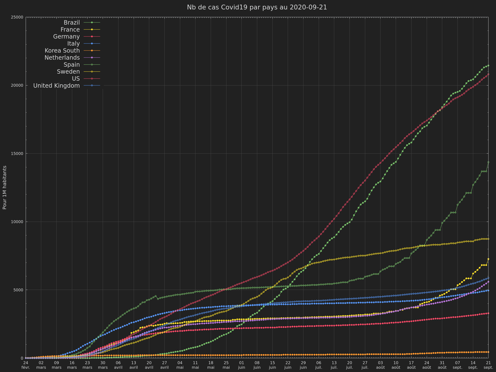
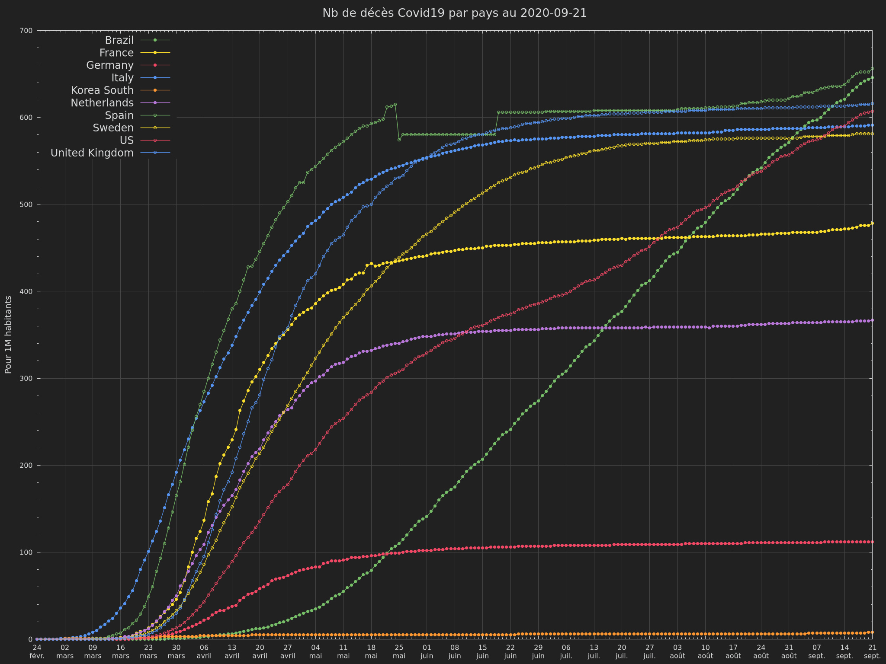
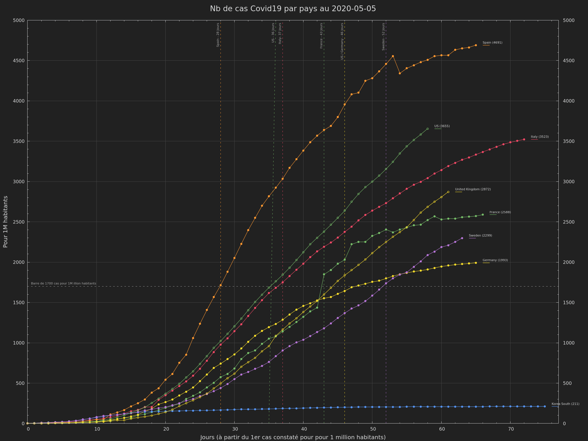
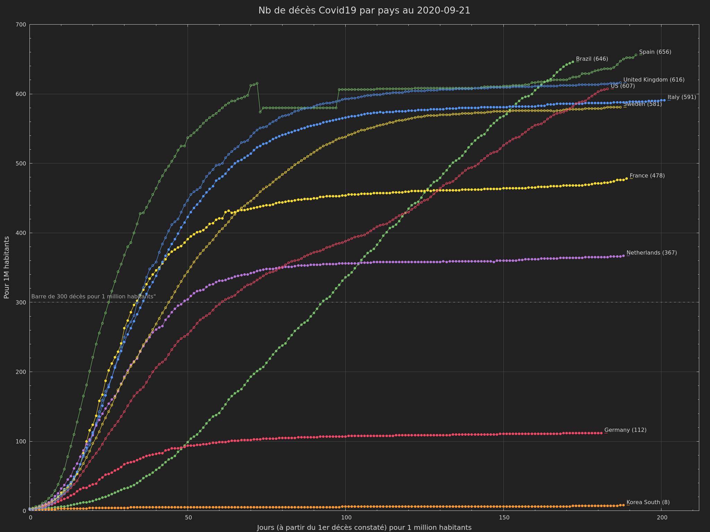

# world-datas-analysis
miscellaneous worlds data and analysis

## Init environment

```
python -m venv .venv
source .venv/bin/activate
pip install -r requirements.txt
```

## Sample


- [Global Covid-19](global/covid-19/README.md)

<a href="global/covid-19/README.md"></a>
<a href="global/covid-19/README.md"></a>
<br/>
<a href="global/covid-19/README.md"></a>
<a href="global/covid-19/README.md"></a>

- [French Covid-19](countries/french/covid-19/README.md)
