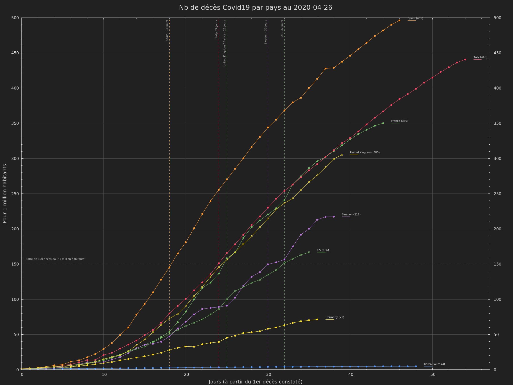

# world-datas-analysis
miscellaneous worlds data and analysis

- covid-19

**Init**

```
python -m venv .venv
source .venv/bin/activate
pip install -r requirements.txt
```

**Covid 19**

**[Optional]** Download/Refresh datas

```
# Download and convert some datas
python covid-19/global/data_download_jhu.py --output covid-19/global/datas/JHU_downloaded.csv
sed -i "s/Korea, South/Korea South/" covid-19/global/datas/JHU_downloaded.csv

# field day distance
POPFILTER=0.0001
FIELDS=(cases deaths)
COUNTRIES="Spain,US,Italy,United Kingdom,France,Germany,Korea South,Sweden"

# Filter and convert datas
for FIELD in $FIELDS; do
    FIELD="pct_${FIELD}"
    python data_manipulation.py --input covid-19/global/datas/JHU_downloaded.csv -f "Country_Region:${COUNTRIES}" -f "Province_State:" -f "?:${FIELD}>=$POPFILTER" --output covid-19/global/datas/${FIELD}_day_distance.csv

    # Convert to gnuplot format
    python csv_to.py --input covid-19/global/datas/${FIELD}_day_distance.csv --format gnuplot --block-by Country_Region --output covid-19/global/datas/${FIELD}_day_distance.dat
done
```

**Generate graphs**

```
UNIT=10000
FIELDS=(cases deaths)
for FIELD in $FIELDS; do
    FIELD="pct_${FIELD}"
    TDATE=$(grep "2020" covid-19/global/datas/${FIELD}_day_distance.dat | cut -d" " -f1 | sort | tail -n1)
    gnuplot -e "field='${FIELD}';unit=${UNIT};tdate='${TDATE}'" gnuplot/color_grafana.plt covid-19/global/gnuplot/day_distance.gp
    #convert -density 300 covid-19/global/pictures/${FIELD}_day_distance_high.eps covid-19/global/pictures/${FIELD}_day_distance_high_eps.png
    #convert -density 144 /tmp/covid_${FIELD}_high.svg /tmp/covid_${FIELD}_high_svg.png
done
```

Image result :



[Gnuplot Datafile source](https://raw.githubusercontent.com/badele/world-datas-analysis/master/covid-19/global/datas/pct_deaths_day_distance.dat)
