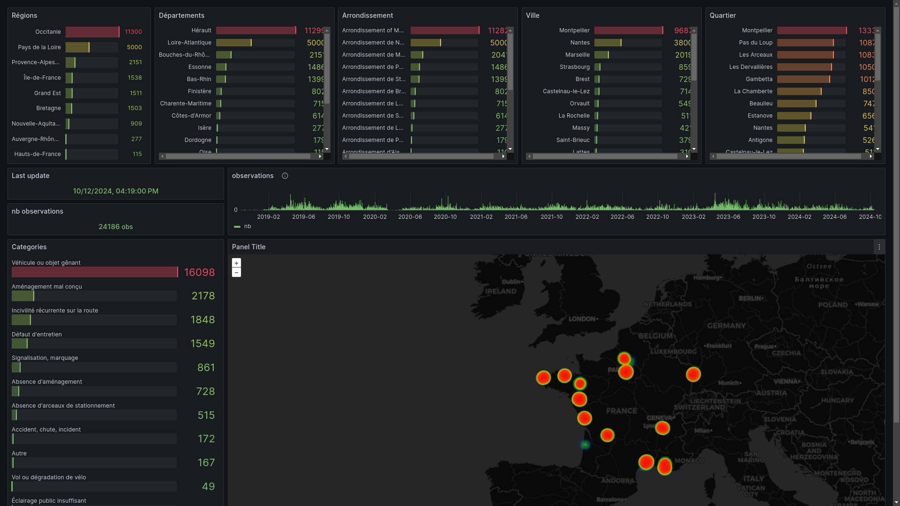
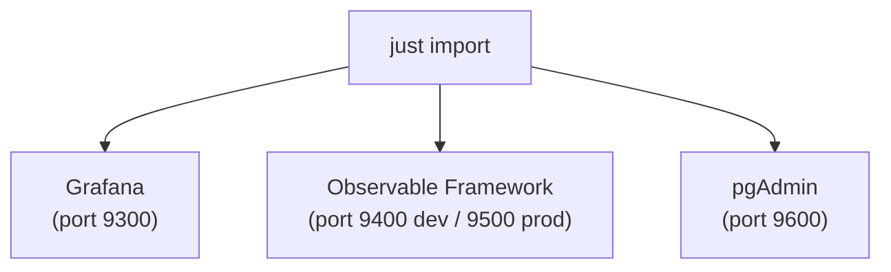
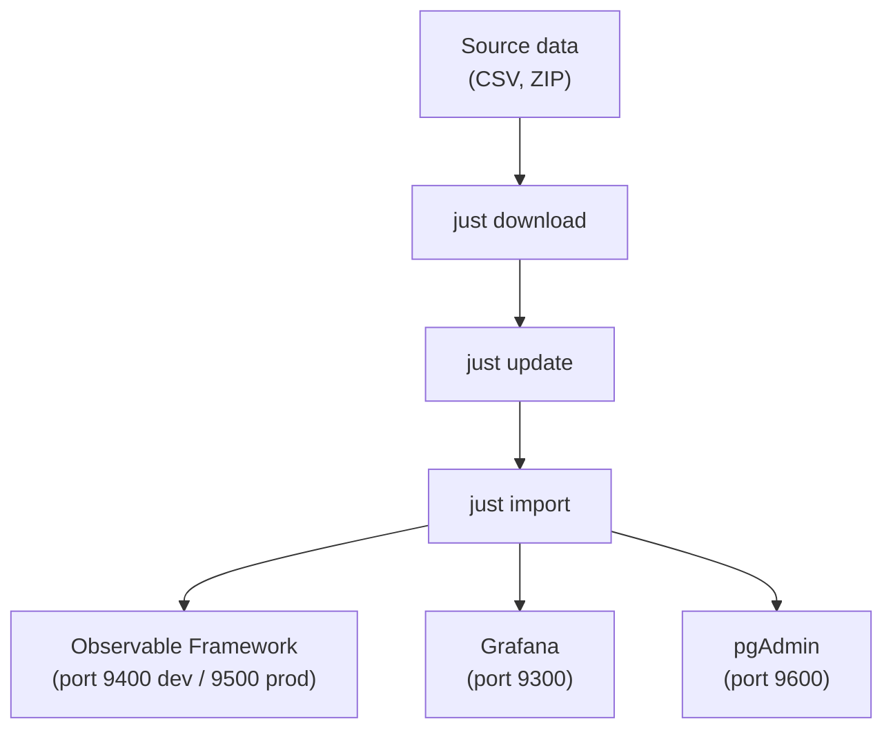

# World Data Analysis

A platform for exploring French and international open data: urban mobility,
economic activity, geography. Data is visualised through **Observable
Framework** (interactive interface) and **Grafana** (dashboards).



---

## Available datasets

| Dataset          | Description                                                        | Source                                                                                                                   |         Entries |
| ---------------- | ------------------------------------------------------------------ | ------------------------------------------------------------------------------------------------------------------------ | --------------: |
| **Vigilo**       | Citizen reports related to cycling and pedestrian travel           | [vigilo.city](https://vigilo.city)                                                                                       |         ~25,000 |
| **SIRENE**       | National registry of French businesses and establishments (INSEE)  | [data.gouv.fr](https://www.data.gouv.fr/fr/datasets/base-sirene-des-entreprises-et-de-leurs-etablissements-siren-siret/) |            ~2 M |
| **NAF Rev. 2**   | French economic activity classification (5 hierarchy levels)       | [INSEE](https://www.insee.fr)                                                                                            |   732 APE codes |
| **GeoNames**     | Global geographic reference (cities, countries, commune codes)     | [geonames.org](https://geonames.org)                                                                                     | ~534,000 cities |
| **Eco-counters** | Cycling and pedestrian counts — Montpellier Méditerranée Métropole | [data.montpellier3m.fr](https://data.montpellier3m.fr)                                                                   |         ~54,000 |

---

## Architecture

### Visualize data


```mermaid
flowchart TD
    D[just import]
    D --> F["Grafana\n(port 9300)"]
    D --> E["Observable Framework\n(port 9400 dev / 9500 prod)"]
    D --> G["pgAdmin\n(port 9600)"]
```

### Contribute


```mermaid
flowchart TD
    A["Source data\n(CSV, ZIP)"] --> B[just download]
    B --> C[just update]
    C --> D[just import]
    D --> E["Observable Framework\n(port 9400 dev / 9500 prod)"]
    D --> F["Grafana\n(port 9300)"]
    D --> G["pgAdmin\n(port 9600)"]
```

**Tech stack:**

- [DuckDB](https://duckdb.org/) — high-performance data processing and Parquet
  conversion
- [PostgreSQL](https://www.postgresql.org/) — relational database queried by
  Observable and Grafana
- [Observable Framework](https://observablehq.com/framework/) — interactive data
  exploration interface
- [Grafana](https://grafana.com/) — dashboards and time-series visualisation
- [Docker Compose](https://docs.docker.com/compose/) — service orchestration
- [Git LFS](https://git-lfs.com/) — Parquet file storage in the repository

---

## Prerequisites

- Docker + Docker Compose v2
- [just](https://just.systems/) (task runner)
- Git LFS

```bash
# Initialise Git LFS (required for Parquet files)
git lfs install

# Check dependencies
just requirements-check
```

---

## Quick start

### Explore data (Parquet files already available via Git LFS)

```bash
just import     # Load Parquet files into PostgreSQL
just start      # Start all services
```

| Port | Service                        | URL                   | Credentials |
| ---- | ------------------------------ | --------------------- | :---------: |
| 9300 | Grafana                        | http://localhost:9300 | admin/admin |
| 9400 | Observable (dev, hot-reload)   | http://localhost:9400 |      —      |
| 9500 | Observable (production, nginx) | http://localhost:9500 |      —      |
| 9600 | pgAdmin                        | http://localhost:9600 |   wda/wda   |

### Refresh data from sources

```bash
just download           # Download source files
just update             # Convert to Parquet (DuckDB)
just import             # Load into PostgreSQL
```

To process a specific dataset:

```bash
DATAS_LIST=sirene just update
DATAS_LIST=sirene just import
```

> **Note:** `DATAS_LIST` accepts multiple comma-separated dataset names:
>
> ```bash
> DATAS_LIST=sirene,vigilo just update
> DATAS_LIST=geonames,vigilo,nafrev2,sirene just import
> ```

Available datasets: `geonames`, `vigilo`, `sirene`, `nafrev2`

---

## Services

### Observable Framework

Interactive data exploration with maps, charts and filterable tables.

```bash
just observable-dev     # Start dev server with hot-reload (port 9400)
just observable-build   # Production build
```

### Grafana

Dashboards for visualising reports and trends. Available at
http://localhost:9300 (`admin/admin`).

### pgAdmin

PostgreSQL administration interface available at http://localhost:9600.

---

## Command reference

```
just help               # List all available commands

# Data pipeline
just download           # Download source files
just update             # Convert CSV → Parquet (DuckDB)
just import             # Load Parquet → PostgreSQL
just db-reset           # Reset the DuckDB database

# Services
just start              # Start all Docker services
just stop               # Stop all services
just observable-dev     # Observable in development mode
just observable-build   # Build Observable (production)

# Tools
just duckdb             # Interactive DuckDB CLI
just psql               # Interactive PostgreSQL CLI
just lint               # Check code formatting
just precommit-install  # Configure git pre-commit hooks
```

---

## Reference scopes

Datasets are linked to geographic scopes so they can be cross-referenced. For
example, a SIRENE establishment can be joined to a GeoNames city via the INSEE
commune code.

<!-- BEGIN SCOPEREFERENCE -->

| provider | dataset                | wda_scope | source               | nb_variables | nb_entries |
| -------- | ---------------------- | --------- | -------------------- | -----------: | ---------: |
| geonames | wda_geonames_cities    | city      | https://geonames.org |           98 |     534217 |
| geonames | wda_geonames_countries | country   | https://geonames.org |           20 |        252 |

<!-- END SCOPEREFERENCE -->

---

## Roadmap

| Status | Category   | Scope         | Dataset                                                                                                                                                    |
| ------ | ---------- | ------------- | ---------------------------------------------------------------------------------------------------------------------------------------------------------- |
| ✅     | GeoNames   | Worldwide     | [Cities and countries](https://download.geonames.org/export/dump/)                                                                                         |
| ✅     | Mobility   | Montpellier   | [Cycling/pedestrian eco-counters](https://data.montpellier3m.fr/dataset/comptages-velo-et-pieton-issus-des-eco-compteurs/resource/edf3e04f-9409-40fe-be66) |
| ✅     | Mobility   | France        | [Vigilo — citizen reports](https://vigilo.city)                                                                                                            |
| ✅     | Economy    | France        | [SIRENE — business registry](https://www.data.gouv.fr/fr/datasets/base-sirene-des-entreprises-et-de-leurs-etablissements-siren-siret/)                     |
| 🛒     | Health     | Worldwide     | [COVID-19 — Johns Hopkins University](https://github.com/CSSEGISandData/COVID-19)                                                                          |
| 🛒     | Climate    | Worldwide     | [Temperature anomalies — NASA GISS](https://data.giss.nasa.gov/gistemp/)                                                                                   |
| 🛒     | Population | French cities | [INSEE estimates](https://www.insee.fr/fr/statistiques/1893198)                                                                                            |
| 🛒     | Population | Worldwide     | [United Nations](https://population.un.org/wpp/Download/Standard/Population/)                                                                              |
| 🛒     | Mobility   | Montpellier   | [VéloMagg — bike sharing](https://data.montpellier3m.fr/dataset/courses-des-velos-velomagg-de-montpellier-mediterranee-metropole)                          |
| 🛒     | Weather    | Cities        | [ECMWF](https://confluence.ecmwf.int/display/WEBAPI/Accessing+ECMWF+data+servers+in+batch)                                                                 |
| 🛒     | Energy     | Worldwide     | [CO₂ emissions — University of Oslo](https://folk.universitetetioslo.no/roberan/GCB2020.shtml)                                                             |
