# Covid-19 Summaries

## Download JHU datas and Graph
```
# Use virtualenn python environment
source .venv/bin/activate

# Download datas from official JHU repository
python international/covid-19/download_from_jhu.py

# Clean and join datas
sqlite3 world-datas-analysis.db < international/covid-19/import_global_covid19_jhu.sql

# Export to CSV
sqlite3 world-datas-analysis.db < international/covid-19/export_global_covid19_jhu.sql

# Generate graphs
international/covid-19/generate_graphs.sh
```


# Global Graphs

### Cases

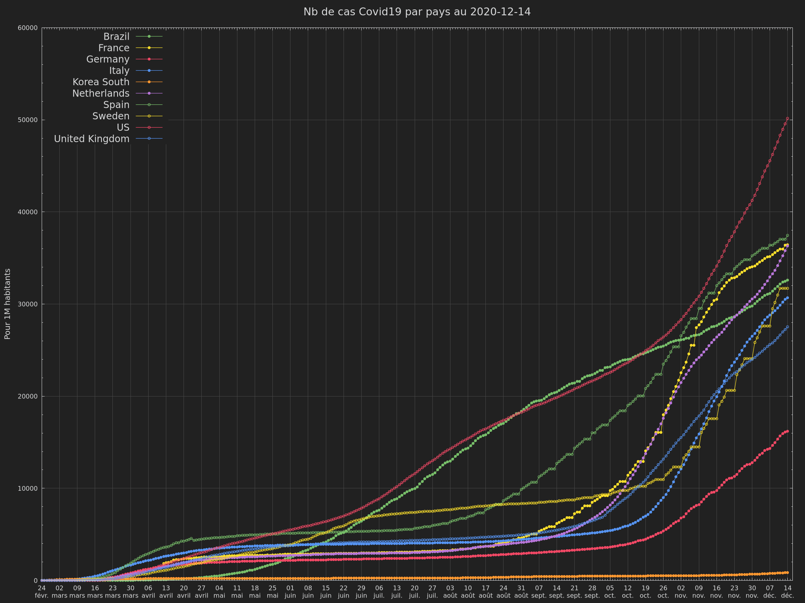

[Gnuplot Datafile source](datas/countries_ratio_cases_for_1000000hab.gdata)


### Deaths

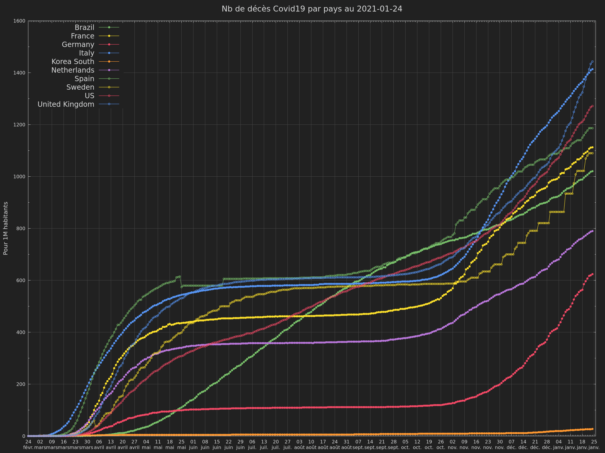

[Gnuplot Datafile source](datas/countries_ratio_deaths_for_1000000hab.gdata)


# Filter value datas

### Cases

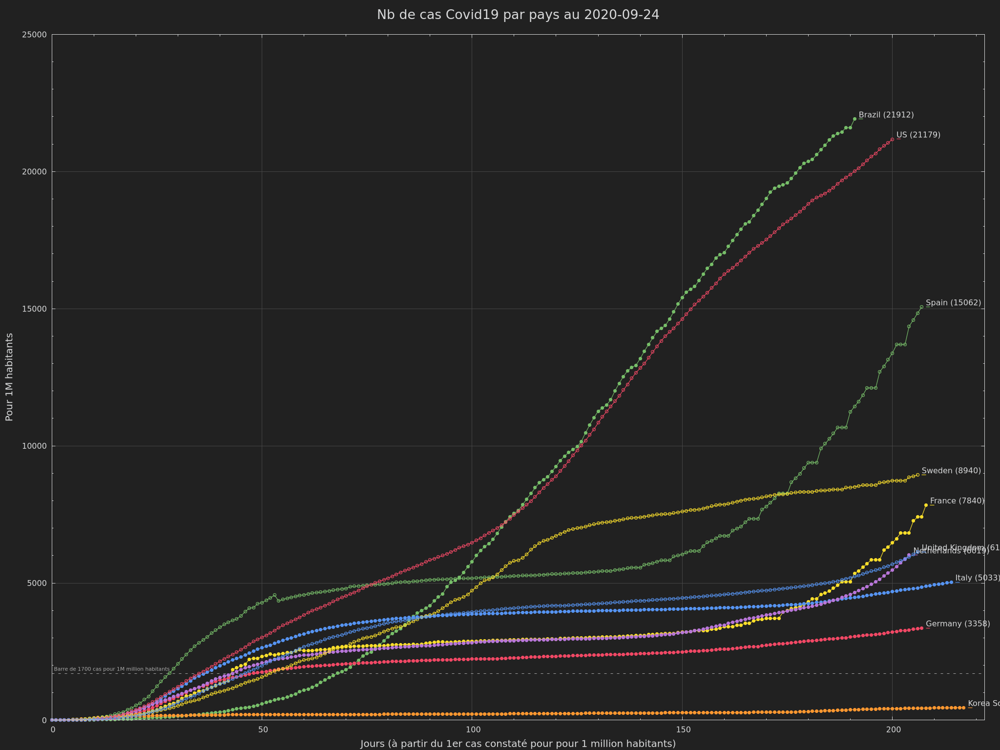

[Gnuplot Datafile source](datas/countries_ratio_cases_filter_1_for_1000000hab.gdata)


### Deaths

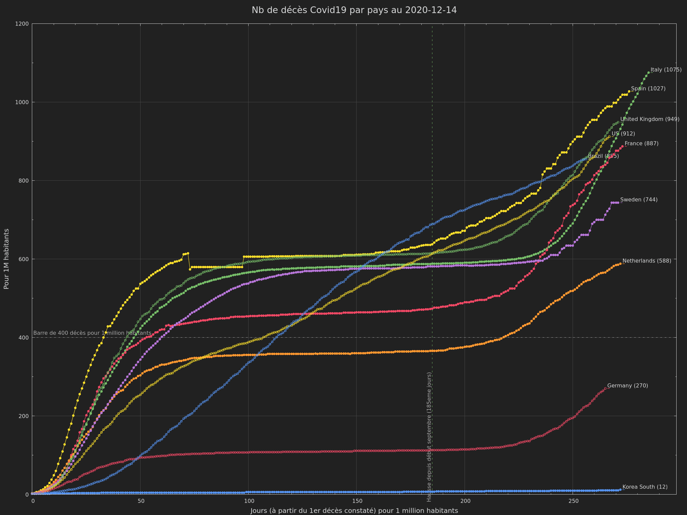

[Gnuplot Datafile source](datas/countries_ratio_deaths_filter_1_for_1000000hab.gdata)


### Deaths by country

### Brazil

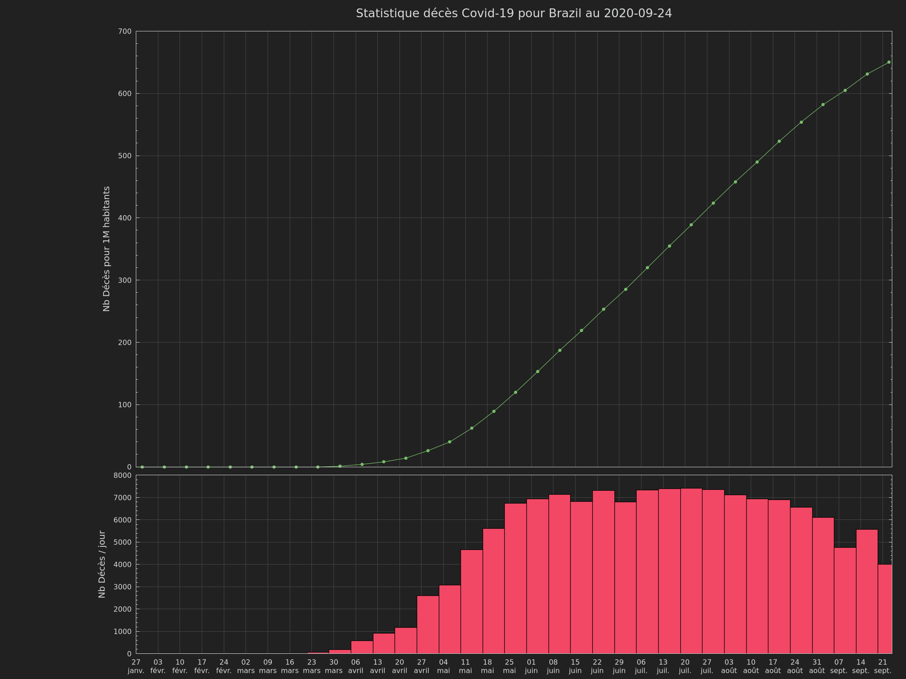

[Gnuplot Datafile source](datas/countries_ratio_deaths_for_1000000hab.gdata)


### France

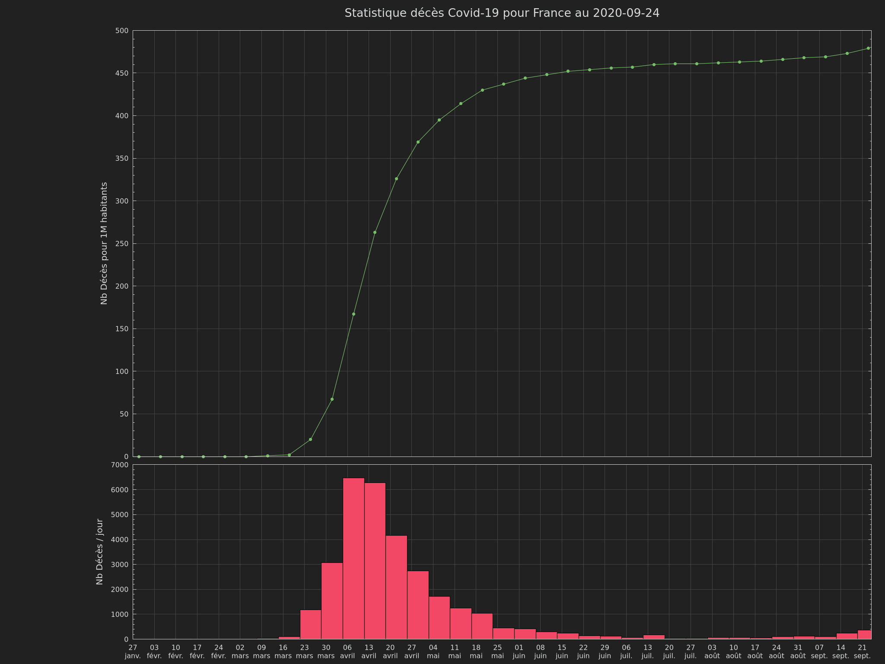

[Gnuplot Datafile source](datas/countries_ratio_deaths_for_1000000hab.gdata)


### Germany

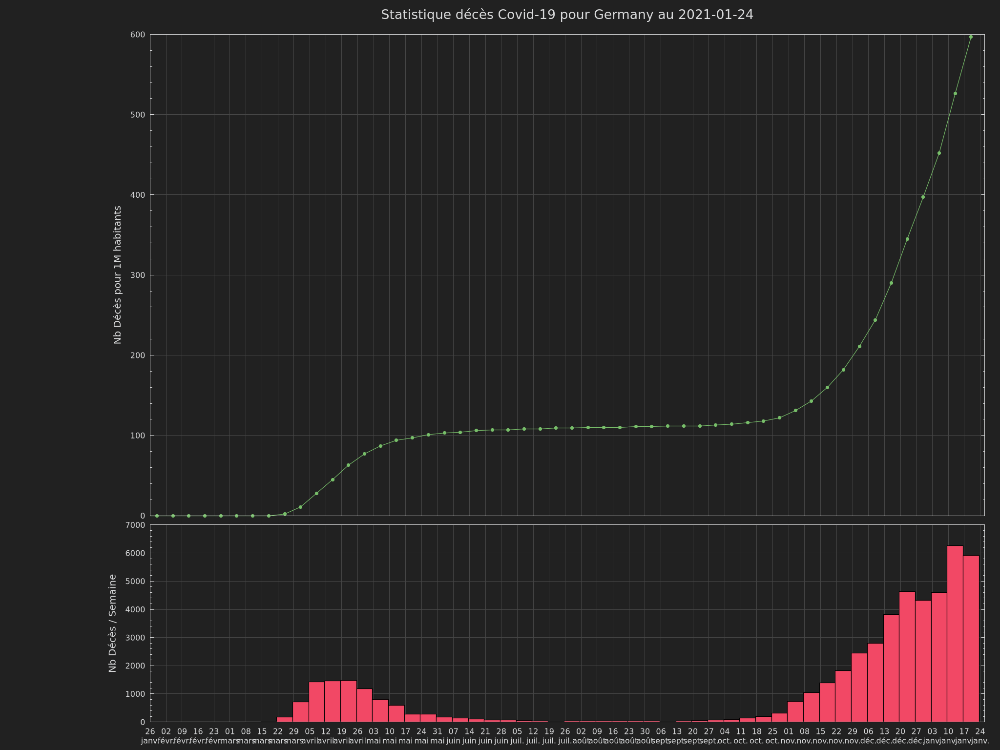

[Gnuplot Datafile source](datas/countries_ratio_deaths_for_1000000hab.gdata)


### Italy

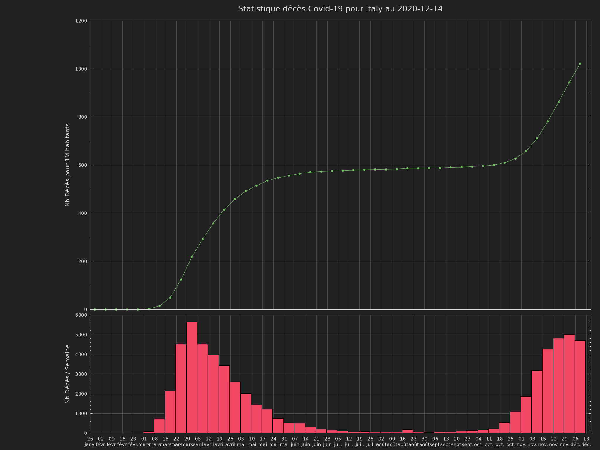

[Gnuplot Datafile source](datas/countries_ratio_deaths_for_1000000hab.gdata)


### Korea South


[Gnuplot Datafile source](datas/countries_ratio_deaths_for_1000000hab.gdata)


### Netherlands

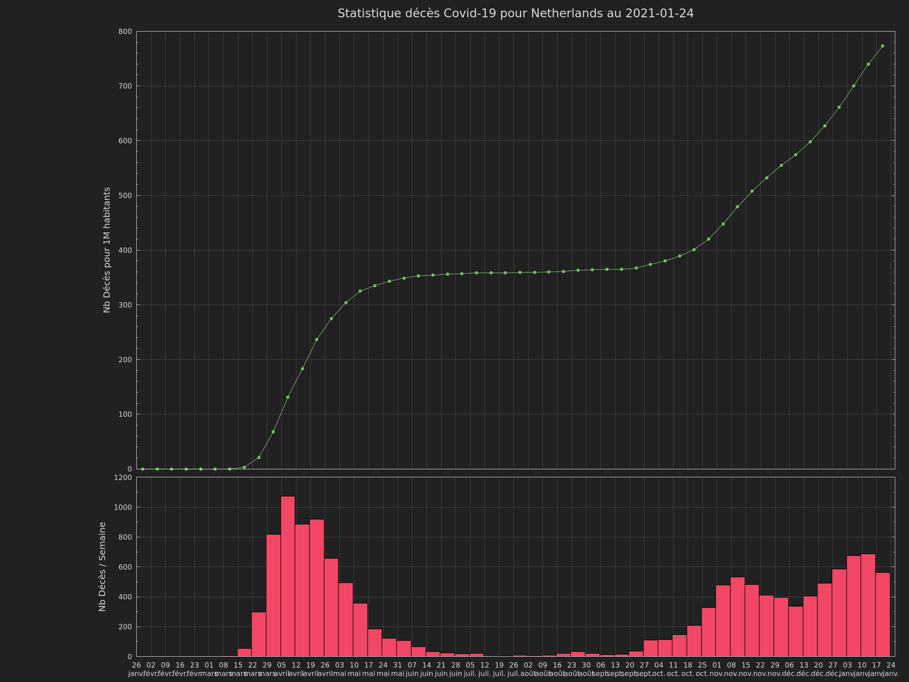

[Gnuplot Datafile source](datas/countries_ratio_deaths_for_1000000hab.gdata)


### Spain

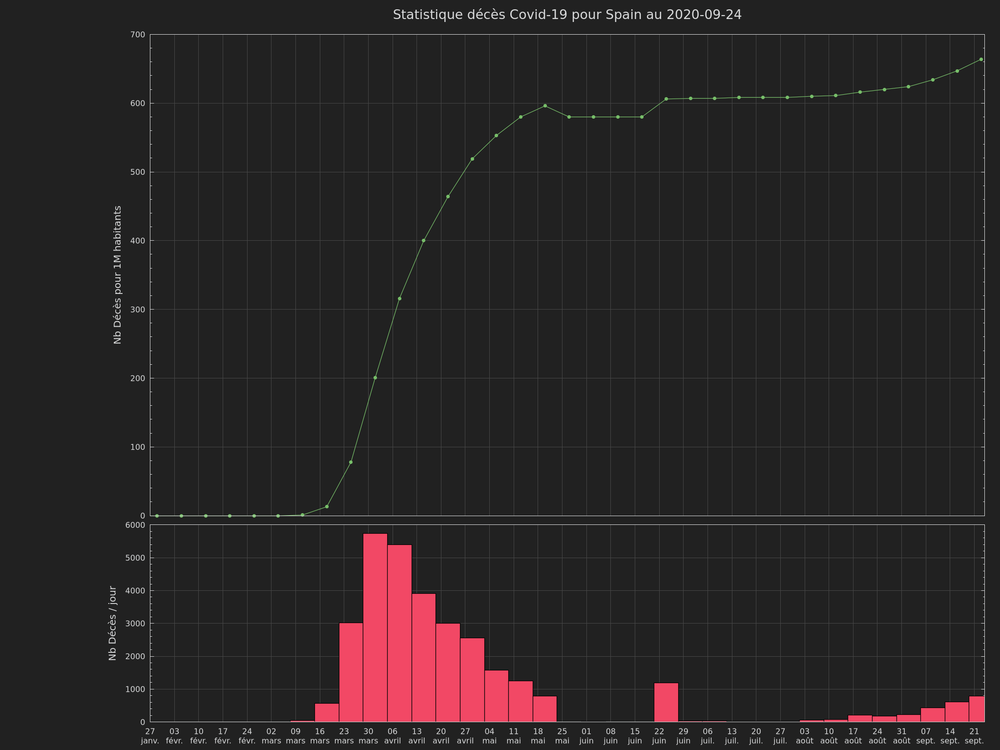

[Gnuplot Datafile source](datas/countries_ratio_deaths_for_1000000hab.gdata)


### Sweden

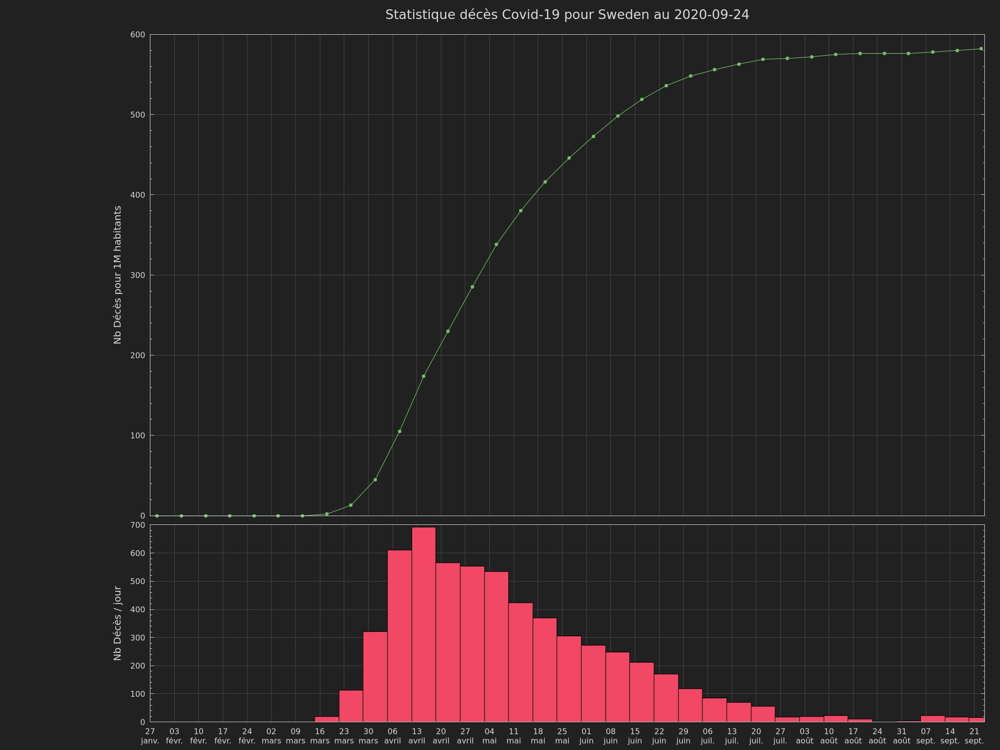

[Gnuplot Datafile source](datas/countries_ratio_deaths_for_1000000hab.gdata)


### United Kingdom


[Gnuplot Datafile source](datas/countries_ratio_deaths_for_1000000hab.gdata)


### US

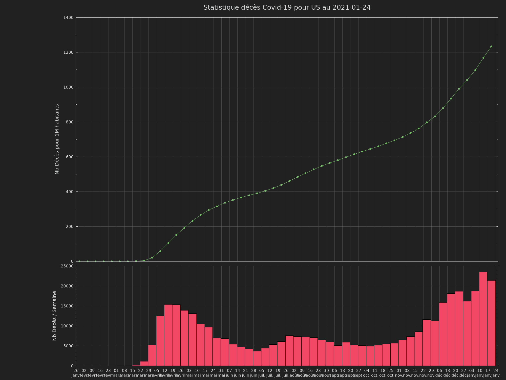

[Gnuplot Datafile source](datas/countries_ratio_deaths_for_1000000hab.gdata)
